# 📋 Halilhoca.com — Kapsamlı İlerleme Raporu

> **Proje:** Halilhoca.com Dijital Eğitim Ekosistemi
> **Versiyon:** 2.0
> **Son Güncelleme:** 14 Şubat 2026
> **Hazırlayan:** Yazılım Geliştirme Ekibi
> **Durum:** Production (Canlı)

---

## 📑 İçindekiler

1. [Yönetici Özeti](#-yonetici-ozeti)
2. [Sistem Mimarisi](#-sistem-mimarisi)
3. [Veritabanı Tasarımı](#-veritabanı-tasarımı)
4. [API Referansı](#-api-referansı)
5. [Frontend Bileşenleri](#-frontend-bileşenleri)
6. [Güvenlik Mimarisi](#-güvenlik-mimarisi)
7. [Oyunlaştırma Sistemi](#-oyunlaştırma-sistemi)
8. [Lig & Sıralama Sistemi](#-lig--sıralama-sistemi)
9. [Deploy & DevOps](#-deploy--devops)
10. [Görsel Tasarım Sistemi](#-görsel-tasarım-sistemi)
11. [Performans Metrikleri](#-performans-metrikleri)
12. [Git Geçmişi & Sürüm Kontrolü](#-git-geçmişi--sürüm-kontrolü)
13. [Gelecek Yol Haritası](#-gelecek-yol-haritası)

---

## 📊 Yönetici Özeti

Halilhoca.com, basit bir turnuva takip uygulamasından **tam donanımlı bir dijital eğitim ekosistemi**ne dönüştürülmüştür. Proje kapsamında gerçekleştirilen temel çalışmalar:

| Kategori | Değer |
|----------|-------|
| **Frontend Bileşenleri** | 19 React bileşeni |
| **Backend API Route'ları** | 9 route dosyası, 35+ endpoint |
| **Veritabanı Modelleri** | 7 Mongoose şeması |
| **CSS Satır Sayısı** | ~5,900+ satır (özel tasarım sistemi) |
| **Rozet Sayısı** | 20 (10 ders + 10 quiz) |
| **Lig Katmanı** | 5 (Bronz → Elmas) |
| **Seviye Sistemi** | 6 kademe (Çaylak → Efsane) |
| **Desteklenen Roller** | 4 (Admin, Staff, Student, Parent) |
| **Deploy Platformu** | DigitalOcean + Docker + MongoDB |

### Tamamlanan Modüller
```
✅ Kimlik Doğrulama & Yetkilendirme    ✅ Turnuva Yönetim Sistemi
✅ Soru Bankası & Günlük Quiz           ✅ Ders Takip & Program Yönetimi
✅ Rozet & Başarı Sistemi (20 rozet)    ✅ Lig Sıralama Sistemi (5 lig)
✅ Ödeme Takip Modülü                   ✅ Dosya Yükleme Servisi
✅ Kullanıcı Yönetim Paneli             ✅ Production Deploy (Docker)
✅ Responsive Tasarım (Mobile-first)    ✅ XP & Seviye Sistemi
```

---

## 🏗️ Sistem Mimarisi

### Yüksek Düzey Mimari

```mermaid
graph TB
    subgraph Client ["🖥️ Frontend (React + Vite)"]
        LP[LandingPage]
        AUTH[LoginPage / RegisterPage]
        SIDE[Sidebar Navigation]
        HOME[HomePage Dashboard]
        QUIZ[DailyQuizPage]
        QB[QuizBankPage]
        SP[StudentPanel]
        PROF[ProfilePage]
        LEAGUE[LeaguePage]
        ARENA[Arena - Setup/Draw/Dashboard/Match]
        STUDY[StudySection / EnglishSection]
        UM[UserManagement]
    end

    subgraph Server ["⚙️ Backend (Node.js + Express)"]
        MW[Middleware - verifyToken / checkRole]
        R1[auth.js]
        R2[tournaments.js]
        R3[lessons.js]
        R4[payments.js]
        R5[questions.js]
        R6[files.js]
        R7[quizQuestions.js]
        R8[badges.js]
        R9[leagues.js]
    end

    subgraph Database ["🗄️ MongoDB"]
        M1[(User)]
        M2[(Tournament)]
        M3[(LessonSchedule)]
        M4[(Payment)]
        M5[(Question)]
        M6[(QuizQuestion)]
        M7[(QuizAttempt)]
    end

    Client -->|HTTPS / JWT| Server
    Server -->|Mongoose ODM| Database
```

### Teknoloji Stack Detayları

| Katman | Teknoloji | Versiyon | Kullanım Amacı |
|--------|-----------|----------|----------------|
| **Runtime** | Node.js | 20 (Alpine) | Sunucu ortamı |
| **Framework** | Express.js | 4.x | HTTP sunucu, middleware, routing |
| **Frontend** | React | 18.x | Bileşen tabanlı UI |
| **Build Tool** | Vite | 7.3.1 | Hızlı build, HMR, tree-shaking |
| **Animasyon** | Framer Motion | Latest | Sayfa geçişleri, mikro-animasyonlar |
| **İkonlar** | Lucide React | Latest | 50+ SVG ikon |
| **DB** | MongoDB | Latest | Doküman tabanlı veritabanı |
| **ODM** | Mongoose | 9.x | Şema doğrulama, query builder |
| **Auth** | jsonwebtoken | Latest | JWT token oluşturma/doğrulama |
| **Şifreleme** | bcryptjs | Latest | Parola hash (salt 10) |
| **Dosya** | Multer | Latest | Çoklu dosya yükleme |
| **Container** | Docker | Multi-stage | Build + production image |
| **Orchestration** | Docker Compose | 3.8 | Multi-container (app + mongo) |

---

## 🗄️ Veritabanı Tasarımı

### Entity-Relationship Diyagramı

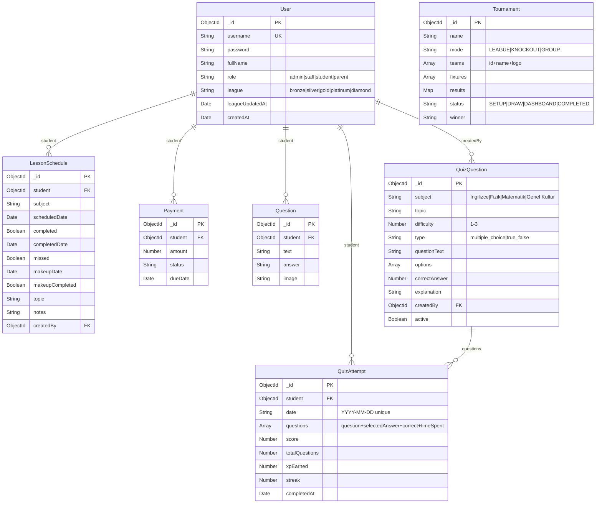

### İndeksler & Performans Optimizasyonları

| Model | İndeks | Tür | Açıklama |
|-------|--------|-----|----------|
| `QuizAttempt` | `{student: 1, date: 1}` | **Unique Compound** | Günde 1 quiz sınırı |
| `QuizQuestion` | `{subject: 1, difficulty: 1, active: 1}` | **Compound** | Günlük quiz soru seçimi |
| `User` | `{username: 1}` | **Unique** | Benzersiz kullanıcı adı |

---

## 📡 API Referansı

### Kimlik Doğrulama (`/api/auth`)

| Method | Endpoint | Auth | Açıklama | Request Body |
|--------|----------|------|----------|--------------|
| `POST` | `/register` | ❌ | Yeni kullanıcı kaydı | `{username, password, fullName, role?}` |
| `POST` | `/login` | ❌ | Giriş yapma | `{username, password}` |
| `GET` | `/me` | ✅ | Profil bilgisi | — |
| `GET` | `/users` | ✅ Admin | Tüm kullanıcılar | — |
| `PUT` | `/users/:id/role` | ✅ Admin | Rol güncelleme | `{role}` |
| `DELETE` | `/users/:id` | ✅ Admin | Kullanıcı silme | — |

**JWT Token Yapısı:**
```json
{
  "_id": "ObjectId",
  "role": "student|staff|admin|parent",
  "username": "string",
  "iat": 1234567890,
  "exp": 1234654290
}
```
> Token süresi: **24 saat**. `Authorization: Bearer <token>` header ile gönderilir.

---

### Turnuva Yönetimi (`/api/tournaments`)

| Method | Endpoint | Auth | Açıklama |
|--------|----------|------|----------|
| `GET` | `/` | ❌ | Tüm turnuvalar (son güncellenen önce) |
| `GET` | `/:id` | ❌ | Tek turnuva detayı |
| `POST` | `/` | ❌ | Yeni turnuva oluşturma |
| `PUT` | `/:id` | ❌ | Turnuva güncelleme (skor, fikstür, durum) |
| `DELETE` | `/:id` | ❌ | Turnuva silme |

**Turnuva Durum Akışı:**
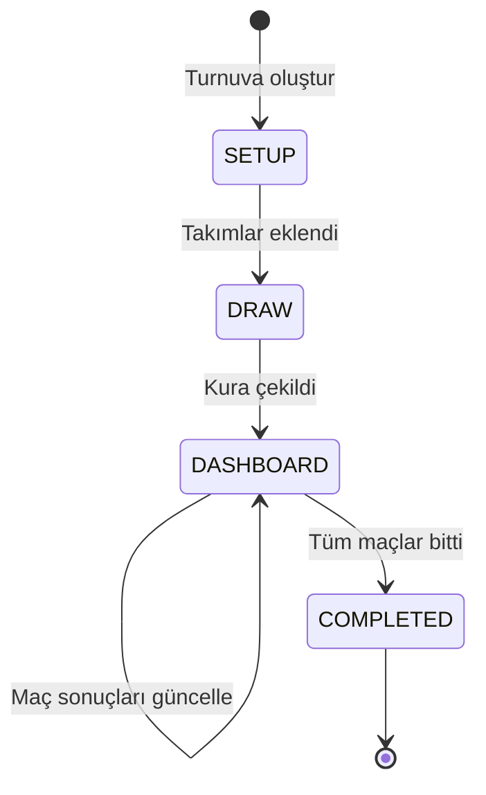

---

### Ders Yönetimi (`/api/lessons`)

| Method | Endpoint | Auth | Açıklama |
|--------|----------|------|----------|
| `GET` | `/` | ✅ | Tüm dersler (admin: hepsi, öğrenci: kendine ait) |
| `POST` | `/` | ✅ Admin/Staff | Yeni ders ekleme |
| `PUT` | `/:id/complete` | ✅ | Ders tamamla |
| `PUT` | `/:id/miss` | ✅ | Ders kaçırıldı + telafi tarihi ata |
| `PUT` | `/:id/makeup` | ✅ | Telafi tamamlandı |
| `PUT` | `/:id/topic` | ✅ | Ders konusu güncelle |
| `DELETE` | `/:id` | ✅ Admin | Ders sil |

**Ders Durumu Akışı:**
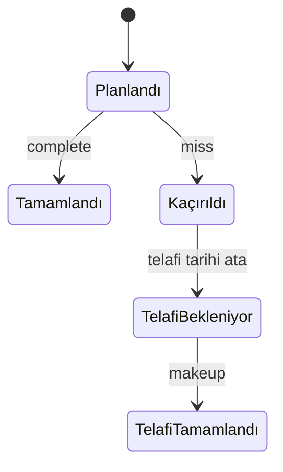

---

### Quiz Sistemi (`/api/quiz`)

| Method | Endpoint | Auth | Açıklama |
|--------|----------|------|----------|
| `GET` | `/questions` | ✅ Admin/Staff | Tüm soru havuzu |
| `POST` | `/questions` | ✅ Admin/Staff | Yeni soru ekle |
| `PUT` | `/questions/:id` | ✅ Admin/Staff | Soru güncelle |
| `DELETE` | `/questions/:id` | ✅ Admin/Staff | Soru sil |
| `GET` | `/daily` | ✅ | Günün 10 sorusu (rastgele, konu dağılımlı) |
| `POST` | `/daily/submit` | ✅ | Günlük quiz gönder |
| `GET` | `/daily/status` | ✅ | Bugün çözüldü mü? |
| `GET` | `/history` | ✅ | Quiz geçmişi |
| `GET` | `/stats` | ✅ | Kişisel istatistikler |
| `GET` | `/leaderboard` | ✅ | Haftalık XP sıralaması |

**Quiz XP Hesaplaması:**
```
xpEarned = (doğru sayısı × 5) + (streak bonusu)
streak_bonus = min(streak × 2, 20)
```

**Günlük Soru Seçim Algoritması:**
1. Aktif sorular filtrelenir (`active: true`)
2. Konu bazlı gruplanır (İngilizce, Fizik, Matematik, Genel Kültür)
3. Her konudan orantılı soru seçilir
4. Zorluk seviyesi karıştırılır (Kolay/Orta/Zor)
5. Toplam **10 soru** döndürülür

---

### Rozet Sistemi (`/api/badges`)

| Method | Endpoint | Auth | Açıklama |
|--------|----------|------|----------|
| `GET` | `/my` | ✅ | Birleşik istatistikler + 20 rozet durumu |

**Yanıt Yapısı:**
```json
{
  "stats": {
    "lessonsTotal": 25,
    "lessonsDone": 18,
    "lessonsMissed": 3,
    "lessonsMakeup": 2,
    "quizCount": 12,
    "quizXP": 180,
    "quizCurrentStreak": 5,
    "quizMaxStreak": 8,
    "quizPct": 72,
    "quizPerfect": 2,
    "totalXP": 395
  },
  "badges": [
    { "id": "first_lesson", "earned": true },
    { "id": "xp_legend", "earned": false }
  ]
}
```

**Birleşik XP Hesaplaması:**
```
totalXP = (lessonsDone × 10) + (lessonsMakeup × 15) + quizXP
```

---

### Lig Sistemi (`/api/leagues`)

| Method | Endpoint | Auth | Açıklama |
|--------|----------|------|----------|
| `GET` | `/standings` | ✅ | Haftalık lig sıralaması (query: `?league=gold`) |
| `GET` | `/my` | ✅ | Kendi lig bilgisi |
| `POST` | `/promote` | ✅ Admin | Haftalık terfi/düşme çalıştır |

**Terfi/Düşme Algoritması:**
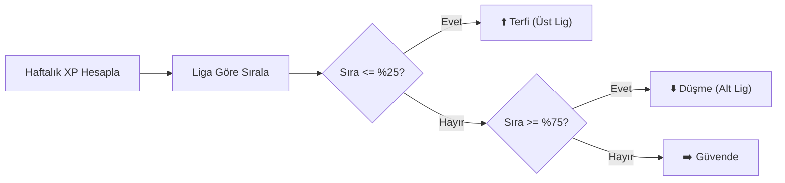

---

### Diğer API'ler

**Ödeme Yönetimi (`/api/payments`):**
| Method | Endpoint | Auth | Açıklama |
|--------|----------|------|----------|
| `GET` | `/` | ✅ | Ödeme listesi |
| `POST` | `/` | ✅ Admin | Yeni ödeme kaydı |
| `PUT` | `/:id/paid` | ✅ Admin | Ödendi işaretle |
| `PUT` | `/:id/overdue` | ✅ Admin | Gecikmiş işaretle |
| `DELETE` | `/:id` | ✅ Admin | Ödeme sil |

**Öğrenci Soruları (`/api/questions`):**
| Method | Endpoint | Auth | Açıklama |
|--------|----------|------|----------|
| `GET` | `/` | ✅ | Soru listesi |
| `POST` | `/` | ✅ | Yeni soru sor (görsel destekli) |
| `PUT` | `/:id/answer` | ✅ Admin/Staff | Soruyu yanıtla |
| `DELETE` | `/:id` | ✅ | Soru sil |

**Dosya Yönetimi (`/api/files`):**
| Method | Endpoint | Auth | Açıklama |
|--------|----------|------|----------|
| `POST` | `/upload` | ✅ | Dosya yükleme (Multer) |
| `GET` | `/list` | ✅ | Yüklenen dosyaları listele |

---

## 🖥️ Frontend Bileşenleri

### Bileşen Hiyerarşisi

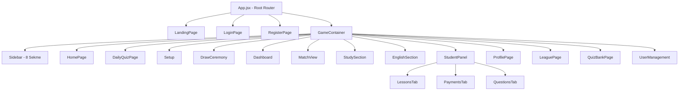

### Bileşen Detayları

| Bileşen | Satır | Açıklama | Ana Özellikler |
|---------|-------|----------|----------------|
| **App.jsx** | 368 | Ana uygulama + routing mantığı | Sayfa yönlendirme, turnuva state yönetimi, kimlik kontrol |
| **LandingPage.jsx** | 131 | Karşılama ekranı | İki bölümlü tasarım (Ders/Oyun), floating animasyonlu ikonlar, neon glow efektleri |
| **LoginPage.jsx** | ~120 | Giriş formu | form validasyonu, hata mesajları, animasyonlu geçişler |
| **RegisterPage.jsx** | ~130 | Kayıt formu | Rol seçimi, şifre güvenliği, otomatik yönlendirme |
| **Sidebar.jsx** | 112 | Navigasyon çubuğu | 8 sekme, daraltılabilir, mobil hamburger, rol bazlı menü |
| **HomePage.jsx** | 177 | Dashboard | Zamana göre selamlama, aktif turnuvalar, yaklaşan dersler, quiz durumu |
| **DailyQuizPage.jsx** | 366 | Günlük quiz motoru | 3 aşama (Ready/Quiz/Result), zamanlayıcı, soru navigasyonu, XP animasyonu |
| **QuizBankPage.jsx** | ~300 | Soru bankası yönetimi | CRUD işlemler, konu/zorluk filtreleme, modal form |
| **StudentPanel.jsx** | 659 | Eğitim paneli (3 sekme) | LessonsTab + PaymentsTab + QuestionsTab |
| **ProfilePage.jsx** | ~200 | Profil + rozetler | 6 stat kartı, 20 rozet, tab filtreleme, seviye XP bar |
| **LeaguePage.jsx** | ~170 | Lig sıralaması | Gradyanlı banner, 5 lig sekmesi, sıralama tablosu, terfi/düşme bölgeleri |
| **Setup.jsx** | ~200 | Turnuva kurulum | Takım ekleme, mod seçimi, isim belirleme |
| **DrawCeremony.jsx** | ~250 | Kura çekimi | Animasyonlu kura, fikstür oluşturma, çift devreli lig |
| **Dashboard.jsx** | 331 | Turnuva puan tablosu | Sıralama, skor düzenleme, admin şifreli erişim, turnuva tamamlama |
| **MatchView.jsx** | ~150 | Maç görünümü | Skor takibi, takım logoları, maç bitirme |
| **StudySection.jsx** | ~100 | Kütüphane | Fizik, Matematik, İngilizce konu kartları |
| **EnglishSection.jsx** | ~200 | İngilizce dersleri | Kelime oyunu, interaktif içerik |
| **UserManagement.jsx** | ~200 | Admin paneli | Kullanıcı listesi, rol değiştirme, kullanıcı silme |
| **TrophyCase.jsx** | ~150 | Kupa vitrini | Tamamlanan turnuva ödülleri, sosyal paylaşım |
| **BackgroundIcons.jsx** | ~50 | Dekoratif arka plan | Floating SVG ikonlar |

---

## 🔐 Güvenlik Mimarisi

### Kimlik Doğrulama Akışı

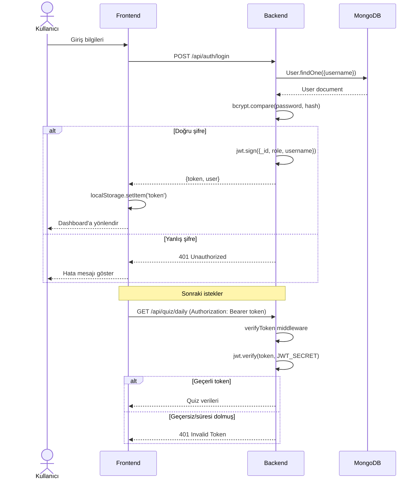

### Güvenlik Katmanları

| Katman | Uygulama | Detay |
|--------|----------|-------|
| **Şifreleme** | bcryptjs (salt: 10) | Rainbow table saldırılarına karşı koruma |
| **Token** | JWT (HS256) | 24 saat TTL, server-side doğrulama |
| **Yetkilendirme** | Role-based (RBAC) | `verifyToken` + `checkRole` middleware zinciri |
| **Veri Bütünlüğü** | Mongoose şema validasyonu | Enum kısıtlamaları, required alanlar, unique indeksler |
| **Quiz Anti-Cheat** | Unique compound index | `{student, date}` — günde 1 quiz sınırı, sunucu taraflı skor hesaplama |
| **Rate Limiting** | Compound index | Aynı kullanıcı aynı günde çoklu quiz gönderemez |

### Middleware Zinciri

```
İstek → Express.json() → cors() → Route Handler → verifyToken → checkRole → Controller → Response
```

---

## 🎮 Oyunlaştırma Sistemi

### XP Kaynakları

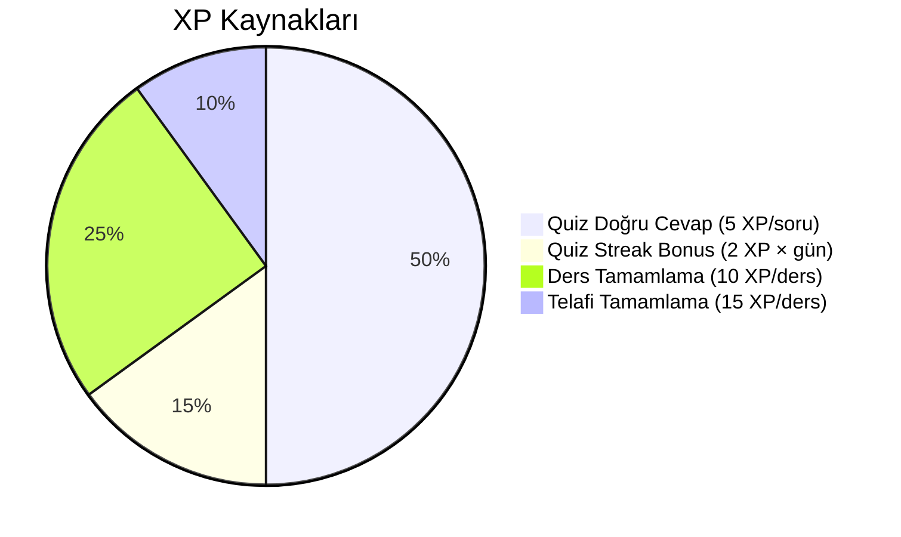

| Kaynak | XP Miktarı | Sınır | Durum |
|--------|------------|-------|-------|
| Quiz doğru cevap | 5 XP/soru | 50 XP/gün (10 soru) | ✅ Aktif |
| Quiz streak bonusu | 2 × gün sayısı | Max 20 XP/gün | ✅ Aktif |
| Ders tamamlama | 10 XP/ders | Sınırsız | ✅ Aktif |
| Telafi tamamlama | 15 XP/telafi | Sınırsız | ✅ Aktif |
| Turnuva katılımı | 20-100 XP | — | 📋 Planlanan |

### Seviye Sistemi

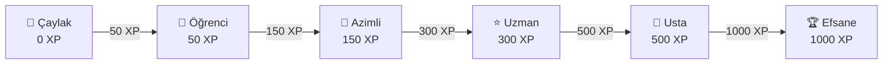

| Seviye | Emoji | XP Eşiği | Gradyan Rengi |
|--------|-------|----------|---------------|
| Çaylak | 🌱 | 0 | `#78716c` (Gri) |
| Öğrenci | 📖 | 50 | `#3b82f6` (Mavi) |
| Azimli | 💪 | 150 | `#8b5cf6` (Mor) |
| Uzman | ⭐ | 300 | `#f59e0b` (Turuncu) |
| Usta | 👑 | 500 | `#ef4444` (Kırmızı) |
| Efsane | 🏆 | 1000 | `#00ff88` (Neon Yeşil) |

### Rozet Sistemi (20 Rozet)

**Ders Rozetleri (10):**

| # | Rozet | Emoji | Koşul | Tür |
|---|-------|-------|-------|-----|
| 1 | İlk Ders | 🎓 | `lessonsDone >= 1` | Milestone |
| 2 | 3 Ders Serisi | 🔥 | `lessonsDone >= 3` | Milestone |
| 3 | 7 Ders Serisi | ⚡ | `lessonsDone >= 7` | Milestone |
| 4 | 10 Ders | 📚 | `lessonsDone >= 10` | Milestone |
| 5 | 20 Ders | 🏆 | `lessonsDone >= 20` | Milestone |
| 6 | 50 Ders | 💎 | `lessonsDone >= 50` | Milestone |
| 7 | Ders Gurusu | 👨‍🏫 | `lessonsDone >= 100` | Elite |
| 8 | Mükemmel Hafta | 🌟 | `lessonsDone >= 5 && lessonsMissed === 0` | Challenge |
| 9 | Telafi Kahramanı | 🔄 | `lessonsMakeup >= 1` | Special |
| 10 | %90 Devam | 🎯 | `devam_oranı >= 90` | Achievement |

**Quiz Rozetleri (10):**

| # | Rozet | Emoji | Koşul | Tür |
|---|-------|-------|-------|-----|
| 11 | İlk Quiz | 🧩 | `quizCount >= 1` | Milestone |
| 12 | Quiz Meraklısı | 📝 | `quizCount >= 5` | Milestone |
| 13 | Quiz Ustası | 🧠 | `quizCount >= 25` | Milestone |
| 14 | Mükemmel Puan | 💯 | `quizPerfect >= 1` (10/10) | Challenge |
| 15 | Seri Başlangıcı | 🔥 | `quizMaxStreak >= 3` | Streak |
| 16 | Haftalık Seri | ⚡ | `quizMaxStreak >= 7` | Streak |
| 17 | Aylık Seri | 🌊 | `quizMaxStreak >= 30` | Streak |
| 18 | XP Avcısı | 💰 | `totalXP >= 100` | Economy |
| 19 | XP Ustası | 💎 | `totalXP >= 500` | Economy |
| 20 | XP Efsanesi | 👑 | `totalXP >= 1000` | Economy |

**Frontend Görsel Özellikleri:**
- **Kazanılmış rozetler:** Neon yeşil çerçeve + ✓ işareti + parlama efekti
- **Kilitli rozetler:** Yarı saydam + 🔒 ikonu + ilerleme çubuğu (ör: `3/7`)
- **Tab filtreleme:** Tümü / 📚 Ders / 🧠 Quiz

---

## 👑 Lig & Sıralama Sistemi

### Lig Yapısı

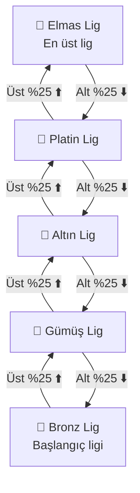

| Lig | Emoji | Renk Kodu | Gradyan |
|-----|-------|-----------|---------|
| **Bronz** | 🥉 | `#cd7f32` | `#cd7f32 → #8b5e3c` |
| **Gümüş** | 🥈 | `#c0c0c0` | `#c0c0c0 → #808080` |
| **Altın** | 🥇 | `#ffd700` | `#ffd700 → #b8860b` |
| **Platin** | 💎 | `#00b4d8` | `#00b4d8 → #0077b6` |
| **Elmas** | 👑 | `#b388ff` | `#b388ff → #7c4dff` |

### Sıralama Tablosu Özellikleri

- **Haftalık XP bazlı sıralama** — her Pazartesi sıfırlanır
- **Bölge işaretleri:**
  - 🟢 Yeşil sol çizgi → Terfi bölgesi (üst %25)
  - ⚪ Gri → Güvenli bölge
  - 🔴 Kırmızı sol çizgi → Düşme bölgesi (alt %25)
- **Kendi satırın** neon yeşil arka plan ile vurgulı
- **Top 3** oyuncu 🥇🥈🥉 emojileri ile gösterilir
- **5 lig arasında tab** ile geçiş yapılabilir

---

## 🚀 Deploy & DevOps

### Docker Mimarisi

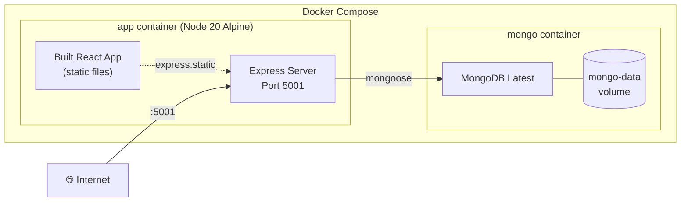

### Dockerfile (Multi-Stage Build)

```dockerfile
# Stage 1: Build Frontend
FROM node:20-alpine as build
WORKDIR /app
COPY package*.json ./
RUN npm install
COPY . .
RUN npm run build

# Stage 2: Production Server
FROM node:20-alpine
WORKDIR /app
COPY server/package*.json ./server/
WORKDIR /app/server
RUN npm install --production
COPY server/ ./
WORKDIR /app
COPY --from=build /app/dist ./server/public/dist
EXPOSE 5001
WORKDIR /app/server
CMD ["node", "index.js"]
```

**Avantajları:**
- Final imaj sadece production bağımlılıklarını içerir
- Frontend build araçları (Vite, React devtools) production'da yok
- Alpine base image → minimal imaj boyutu (~150MB)

### deploy Komutu
```bash
cd app && git pull && docker compose up -d --build
```

### Volume Yapılandırması
| Volume | Container Path | Açıklama |
|--------|---------------|----------|
| `mongo-data` | `/data/db` | MongoDB kalıcı veri |
| `./server/public/questions` | `/app/server/public/questions` | Öğrenci soru görselleri |

---

## 🎨 Görsel Tasarım Sistemi

### Renk Paleti

| Değişken | Renk | Kullanım |
|----------|------|----------|
| `--bg-primary` | `#050505` | Ana arka plan (koyu siyah) |
| `--bg-secondary` | `#0f0f0f` | İkincil arka plan |
| `--accent` | `#00ff88` | Ana vurgu rengi (neon yeşil) |
| `--accent-secondary` | `#00b8ff` | İkincil vurgu (mavi) |
| `--accent-glow` | `rgba(0,255,136,0.4)` | Neon glow efekti |
| `--text-primary` | `#ffffff` | Ana metin |
| `--text-secondary` | `#a0a0a0` | İkincil metin |
| `--glass` | `rgba(255,255,255,0.05)` | Glass-morphism arka plan |
| `--glass-border` | `rgba(255,255,255,0.1)` | Glass-morphism çerçeve |
| `--danger` | `#ff4444` | Hata / tehlike |
| `--warning` | `#ffcc00` | Uyarı |

### Tipografi

| Kullanım | Font | Ağırlıklar |
|----------|------|------------|
| **Başlıklar** | Oswald (sans-serif) | 500, 700 |
| **Gövde metni** | Inter (sans-serif) | 400, 600, 800 |

> Google Fonts CDN üzerinden yükleniyor: `fonts.googleapis.com`

### Tasarım Prensipleri

| Prensip | Uygulama |
|---------|----------|
| **Dark Mode** | Koyu siyah arka plan (#050505), yüksek kontrast metin |
| **Glass-morphism** | Yarı saydam paneller, blur efekti, ince çerçeveler |
| **Neon Glow** | Accent renkte glow efektleri (box-shadow, text-shadow) |
| **Micro-animations** | Framer Motion ile hover, tap, page transition efektleri |
| **Responsive** | Mobile-first, 3 breakpoint (480px, 768px, 1024px) |
| **Grid Layout** | CSS Grid ile kart dizilimleri (1-4 kolonlu) |
| **Gradient** | Lig bannerları, XP barları, butonlarda gradyan kullanımı |

### Animasyon Kataloğu

| Animasyon | Teknik | Kullanım Yeri |
|-----------|--------|---------------|
| Sayfa geçişi | `motion.div initial/animate` | Tüm sayfa değişimleri |
| Hover scale | `whileHover={{ scale: 1.05 }}` | Butonlar, kartlar |
| Tap feedback | `whileTap={{ scale: 0.95 }}` | Tıklanabilir öğeler |
| Staggered entry | `transition={{ delay: i * 0.05 }}` | Liste/grid öğeleri |
| Floating icons | `animate={{ y: [0, -20, 0] }}` | LandingPage arka plan |
| Neon pulse | `animate={{ boxShadow: [...] }}` | LandingPage beyin ikonları |
| Progress bar fill | CSS `transition: width 1s ease` | XP bar, rozet ilerleme |
| Spinner rotate | `animate={{ rotate: 360 }}` | Loading durumları |

---

## 📈 Performans Metrikleri

### Build Çıktıları (Vite 7.3.1)

| Dosya | Boyut | Gzip |
|-------|-------|------|
| `index.html` | 2.25 KB | 0.79 KB |
| `index-*.css` | 73.16 KB | 13.05 KB |
| `html2canvas.esm-*.js` | 201.04 KB | 47.43 KB |
| `index-*.js` | 463.49 KB | 142.44 KB |
| **Toplam** | **~740 KB** | **~204 KB (gzip)** |

### Veritabanı Optimizasyonları

| Strateji | Uygulama |
|----------|----------|
| **Compound Index** | QuizAttempt: `{student, date}` unique |
| **Compound Index** | QuizQuestion: `{subject, difficulty, active}` |
| **Unique Index** | User: `{username}` |
| **Projection** | Lig sıralaması: `select('_id fullName league')` |
| **Aggregation** | Haftalık XP: MongoDB aggregation pipeline |

---

## 🔄 Git Geçmişi & Sürüm Kontrolü

### Son Commit'ler (En yeniden eskiye)

| Commit | Açıklama |
|--------|----------|
| `adff9d7` | docs: Kapsamlı ilerleme raporu + EYLEM_PLANI güncelleme |
| `0098e0d` | feat: Lig sıralama sistemi (5 lig, terfi/düşme) |
| `dc3911a` | feat: Rozet sistemi genişletme (20 rozet, quiz entegrasyonu) |
| `9b3bdf7` | fix: Quiz siyah ekran (JWT _id düzeltme) |
| `24c6f5a` | feat: Soru Bankası + Günlük Quiz sistemi |
| `fb6198f` | Turkish localization |
| `912db5b` | fix: Duplicate import, Node 20 upgrade |
| `f8fde9f` | feat: Dosya yükleme sistemi |
| `e4ea24c` | Link İngilizce → Kelime Kampı |
| `b577a7c` | Double round-robin fikstür |
| `ab78c1d` | Enhanced sosyal paylaşım |
| `48f4a85` | Fizik, Matematik, İngilizce ders kartları |
| `4d82000` | Landing page redesign |
| `cdd8329` | Trophy case + sosyal paylaşım |
| `d2c8b0b` | Initial commit |

---

## 🗺️ Gelecek Yol Haritası

### Kısa Vadeli (Q1-Q2 2026)
- [ ] Beceri ağaçları (Skill Trees) — RPG tarzı ders ilerleme haritası
- [ ] Günlük turnuvalar (belirli saatte açılan yarışmalar)
- [ ] Redis tabanlı gerçek zamanlı leaderboard
- [ ] XP sistemi genişletme (quiz dışı XP kaynakları)

### Orta Vadeli (Q2-Q3 2026)
- [ ] WebSocket entegrasyonu (anlık bildirimler)
- [ ] Öğrenci ilerleme grafikleri
- [ ] Büyük deneme sınavı simülasyonu
- [ ] Kelime oyunları, gramer bulmacaları

### Uzun Vadeli (Q3-Q4 2026)
- [ ] AI destekli soru önerisi
- [ ] Isı haritaları ve hata analizi
- [ ] Video CDN entegrasyonu
- [ ] OpenBadges entegrasyonu

---

> **Not:** Bu rapor her yeni özellik ve sprint sonrasında güncellenmektedir.
> Son güncelleme: 14 Şubat 2026, Yazılım Geliştirme Ekibi
